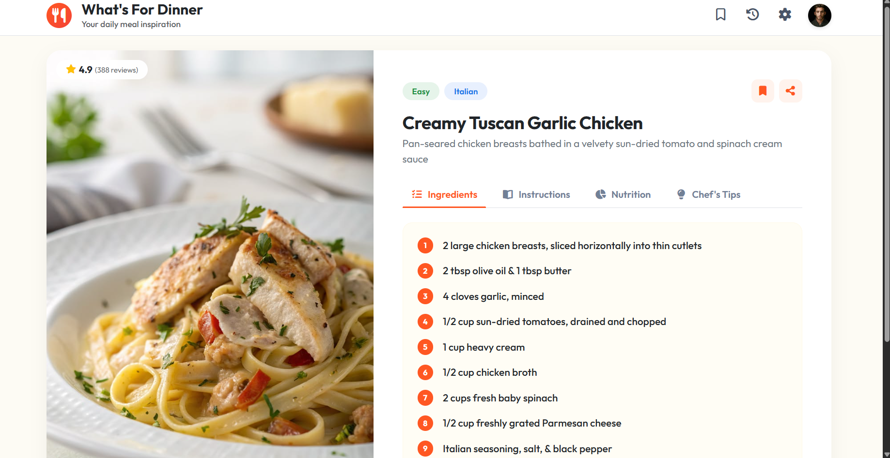
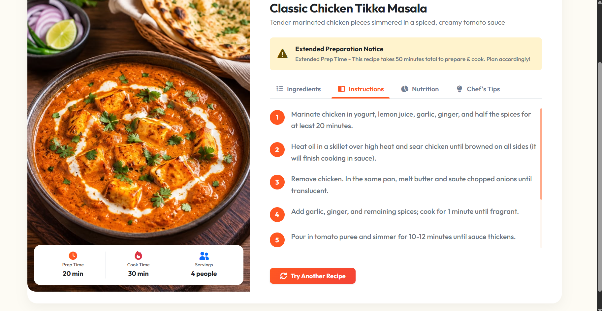
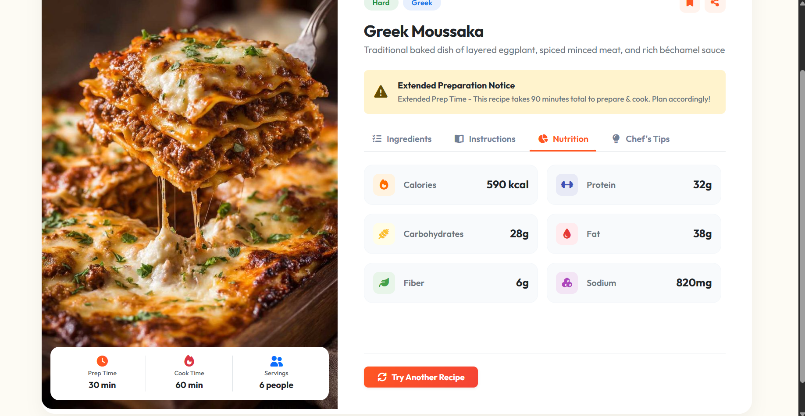
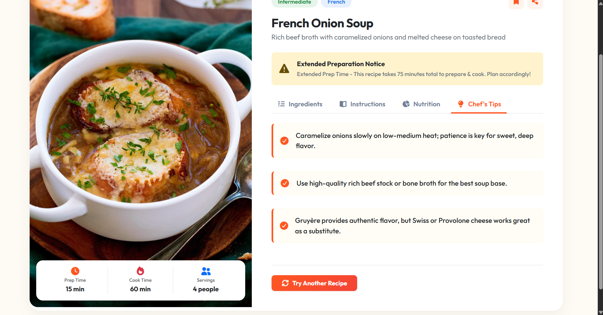
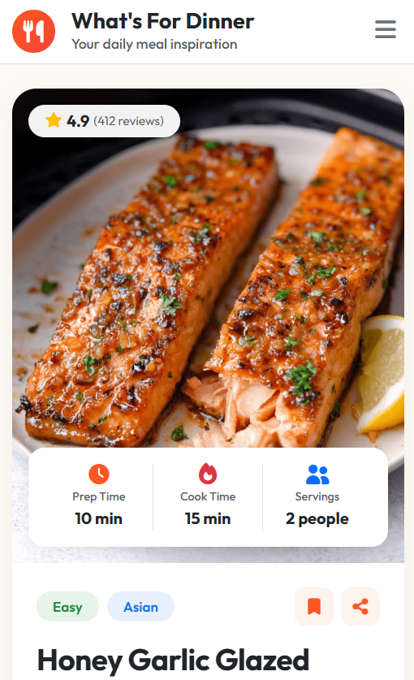
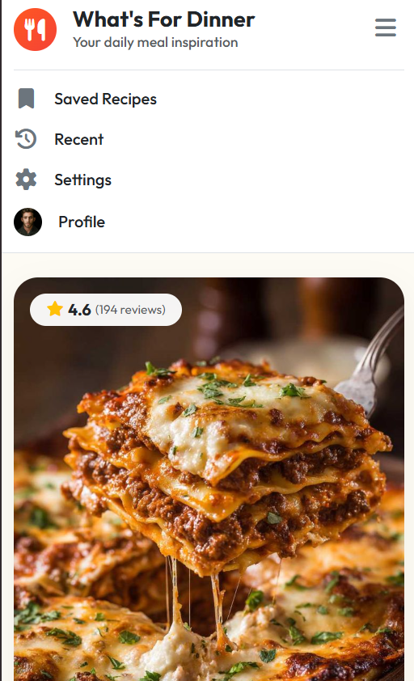

# 🍽️ What's For Dinner - Daily Meal Inspiration App

A modern, responsive web application that generates random delicious dinner recipes, complete with ingredients lists, step-by-step instructions, nutrition metrics, and chef's tips. Built with **HTML5**, **CSS3**, **Bootstrap 5**, **FontAwesome 6**, and **Vanilla JavaScript** for **Route IT Training Center - Frontend Diploma C49**.

---

## ✨ Features

- 🎲 **Random Recipe Selector**: Uses `Math.random()` to generate a new meal recommendation without repeating the same dish twice in a row.
- 📱 **Fully Responsive Layout**: Pixel-perfect responsive design tailored for both desktop and mobile screens.
- ⏱️ **Floating Timing Overlay Card**: Displays **Prep Time**, **Cook Time**, and **Servings** floating seamlessly over the dish hero image.
- ⚠️ **Extended Prep Notice**: Automatically alerts the user when a recipe requires more than 45 minutes total preparation & cook time.
- 📑 **Interactive Tabs System**:
  - 📋 **Ingredients**: Displayed in a warm cream card with numbered orange badges.
  - 👨‍🍳 **Instructions**: Numbered step-by-step cooking steps with custom smooth scrolling.
  - 📊 **Nutrition**: 6 metric cards (Calories, Protein, Carbohydrates, Fat, Fiber, Sodium) with color-tinted icon boxes.
  - 💡 **Chef's Tips**: Helpful cooking advice with checkmark icons.
- 🍔 **Mobile Dropdown Navbar**: Collapsible menu on mobile devices featuring quick navigation links.

---

## 📸 Application Screenshots

### 🖥️ Desktop Overview & Ingredients Tab


### 👨‍🍳 Step-by-Step Instructions Tab


### 📊 Nutrition Grid Tab


### 💡 Chef's Tips Tab


### 📱 Mobile UI & Single-Column Layout


### 🍔 Mobile Hamburger Dropdown Menu


---

## 🛠️ Data Architecture & Code Structure

The application stores all recipe information in a clean, structured **Array of Objects** (`recipes`) in `JS/main.js`:

```javascript
const recipes = [
  {
    id: 1,
    title: "French Onion Soup",
    description: "Rich beef broth with caramelized onions and melted cheese on toasted bread",
    image: "images/french-onion-soup.jpg",
    cuisine: "French",
    difficulty: "Intermediate",
    prepTime: 15,
    cookTime: 60,
    servings: "4 people",
    rating: 4.7,
    reviewsCount: 267,
    ingredients: [...],
    instructions: [...],
    nutrition: { calories: "380 kcal", protein: "18g", carbs: "36g", fat: "18g", fiber: "4g", sodium: "980mg" },
    chefTips: [...]
  },
  // Additional recipe objects...
];
```

### Random Selector Logic (`Math.random()`)
```javascript
function getRandomRecipe() {
  let newIndex;
  if (recipes.length > 1) {
    do {
      newIndex = Math.floor(Math.random() * recipes.length);
    } while (newIndex === currentRecipeIndex); // Prevents immediate repeats
  } else {
    newIndex = 0;
  }
  currentRecipeIndex = newIndex;
  return recipes[newIndex];
}
```

---

## 📂 Project Directory Structure

```text
what-is-for-dinner/
├── CSS/
│   ├── all.min.css              # FontAwesome 6 Icons
│   ├── bootstrap.min.css        # Bootstrap 5 Framework
│   └── main.css                 # Custom Styling & Design System
├── JS/
│   ├── bootstrap.bundle.min.js  # Bootstrap Bundle JS
│   └── main.js                  # Recipe Data & DOM Manipulation
├── images/
│   ├── avatar-4.jpg             # User Profile Picture
│   ├── favicon.png              # Browser Tab Icon
│   ├── french-onion-soup.jpg
│   ├── honey-garlic-salmon.jpg
│   ├── classic-chicken-tikka-masala.jpg
│   ├── creamy-tuscan-garlic-chicken.jpg
│   └── greek-moussaka.jpg
├── screenshots/
│   ├── 01-desktop-overview.png
│   ├── 02-tab-instructions.png
│   ├── 03-tab-nutrition.png
│   ├── 04-tab-chefs-tips.png
│   ├── 05-mobile-screen.png
│   └── 06-mobile-hamburger-menu.png
├── index.html                   # Main HTML Markup
└── README.md                    # Project Documentation
```

---

## 🚀 Technologies Used

- **HTML5**: Semantic markup structure.
- **CSS3**: Custom design system, CSS Grid/Flexbox, transitions, and media queries.
- **Bootstrap 5.3**: Grid system, responsive utility classes, and collapsible navbar.
- **FontAwesome 6**: Rich UI icon set.
- **Vanilla JavaScript**: Pure beginner DOM manipulation and array object handling.

---

